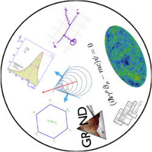

# HEP Doodle Documentation and Guide

This repository contains scripts for generating a guide describing High Energy Physics (HEP) themed "doodle" cards.



The project uses a YAML file (for example, see `symbols.yaml` or `symbols_v2.yaml`) to store the data for each card. This data includes an image, a title, a description, and a URL for more information.

A Python script (`generate_tex.py`) reads the YAML file and generates a LaTeX file. This LaTeX file is then compiled into a PDF, creating a set of printable cards.

## Dependencies

For Python dependencies, please see the `requirements.txt`, `pyproject.toml`, or `environment.yml` file.

A system dependency on `pdflatex` is required to build the PDF.

## Usage

To generate the PDF from the YAML data, you can use the `build.sh` script. First, clone the repository and make the script executable:

```bash
git clone https://github.com/jkbre/HEP-Dooble.git
cd HEP-Doodle
chmod +x ./build.sh
./build.sh <your_yaml_file>.yaml
```

This will:

1. Run `generate_tex.py` to create `symbol_guide_from_yaml.tex`.
2. Compile `symbol_guide_from_yaml.tex` into `symbol_guide_from_yaml.pdf` using `pdflatex`.

## File Descriptions

- `symbols.yaml`, `symbols_v2.yaml`: Data files for the cards.
- `generate_tex.py`: A Python script that generates the `.tex` file from YAML.
- `extract_and_convert.py`: A script to extract data from an old `.tex` file into YAML format.
- `build.sh`: The main build script.
- `preamble.tex`: LaTeX template file.
- `HEP/`: A directory that should contain all the images for the cards (see the Disclaimers section for more information).

## Disclaimers

**PNG files:** The `symbols.yaml` and `symbols_v2.yaml` files reference images that are expected to be in the `HEP/` directory. This directory is not included in the repository. To acquire the necessary PNG files, please contact the creator of this repository or a contributor.

**Technological Hygiene**: This repo was created by a human in collaboration with a machine.

## License

This project is licensed under the MIT License - see the [LICENSE](LICENSE) file for details.

## Credits

The `example_card.png` image was created by [akalinow](https://github.com/akalinow).
